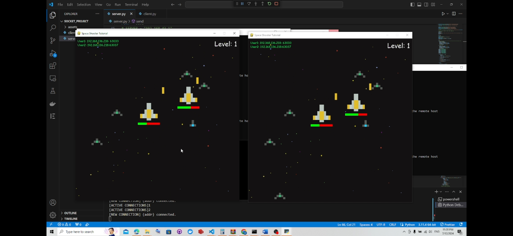

# Raw TCP Multiplayer Game




**TL;DR:** Two-player authoritative space shooter built with raw TCP sockets, explicit 64-byte message framing, a deterministic 60 FPS server tick loop, and semaphore-controlled multithreading. The project focuses on networking correctness, protocol design, and concurrent state management — not on graphics.

---

## Core Technical Challenge

This project demonstrates a real-time multiplayer architecture implemented with **zero networking abstractions**. The system uses:

- **Pure TCP sockets** for all communication  
- **Manually defined framing** (fixed 64-byte ASCII length header + JSON payload)  
- **Deterministic tick-based server simulation** at 60 FPS  
- **Semaphore-protected shared state** across multiple threads  
- **Explicit synchronization rules** instead of any game engines or networking frameworks  

The server is fully authoritative. All simulation — positions, collisions, enemy waves, health, and win/loss resolution — is computed centrally. Clients are thin renderers that only send input and draw the state provided by the server.  

This configuration makes networking behavior, concurrency control, and protocol integrity the primary engineering tasks.


---

## 🎮 Game Overview

Space Shooter Multiplayer is a **two-player 2D action game**:
- Two clients connect to a Python server over raw TCP.
- The **server executes 100% of the simulation** (player/enemy movement, collisions, scoring, level progression).
- **Clients only send input and render** frames using Pygame based on server updates.
- Players control spaceships, shoot descending enemies, and survive progressively harder waves. Last player standing wins.

This repository is intended as an educational, low-level example of networking and multiprocessing for a resume / portfolio.

---

## 🕹️ Gameplay Features

- 2-player cooperative space shooter in a shared arena
- Real-time controls: four-direction movement + shoot
- Progressive difficulty with linear wave scaling
- Health system and win/lose conditions
- Wave-based progression until one player loses

---

## 🏗️ Architecture Overview

### Server — Computational Core
- Single authoritative process that runs the deterministic tick loop (60 ticks/second).
- Accepts up to two clients; spawns `handle_client(conn, addr)` thread for each connection.
- Maintains authoritative state in shared structures:
  - `data` dictionary (positions, health, level, flags)
  - `enemies`, `lasers_data`, `lasers_data2` lists
- Sends framed JSON messages to each client every tick in a strict, ordered sequence.

### Clients — Thin Graphical Renderers
- Connect to server and perform initial handshake.
- Send input each tick: `user_data` and `keys`.
- Receive four framed messages per tick and rebuild local state.
- Render via Pygame at 60 FPS using authoritative data; **no local game logic** beyond input sampling.

---

## 📡 Networking & Protocol

This section describes the exact encoding, framing, and per-tick messaging agreements that ensure determinism and reliable reconstruction of world state over TCP.

### Message framing
- All messages are JSON objects encoded in UTF-8.
- Every payload is preceded by a **64-byte ASCII header**:
  - The header contains the payload length as a decimal ASCII string, **right-padded with spaces** to 64 bytes.
  - Example header: `b'1234                                                           '`.
- **Wire format:** `header (64 bytes ASCII)` + `payload (length bytes)`.
- Rationale: TCP is a byte stream; explicit framing is mandatory to detect message boundaries and avoid message coalescing/fragmentation issues.

### Receiver: exact byte reads
Use a blocking helper that reads exactly `n` bytes:

```python
def recvn(sock, n):
    # read exactly n bytes from socket or raise ConnectionError if closed.
    buf = b''
    while len(buf) < n:
        chunk = sock.recv(n - len(buf))
        if not chunk:
            raise ConnectionError("socket closed")
        buf += chunk
    return buf

# Example usage:
hdr = recvn(sock, 64)
length = int(hdr.decode('ascii').strip())
payload = recvn(sock, length)
obj = json.loads(payload.decode('utf-8'))
```

**Important:** All receivers must use `recvn` semantics. Using `recv` without exact-length loops will break framing under realistic TCP conditions.

### Message ordering (per-tick)
Per authoritative design, **order is mandatory**. The server and clients must strictly respect the following sequences.

**Server → Client (4 framed messages per tick, exact order):**
1. `data` — authoritative dictionary with players, health, level, flags, identities  
2. `lasers_player1` — JSON array of `{ "x": ..., "y": ... }`  
3. `lasers_player2` — JSON array of `{ "x": ..., "y": ... }`  
4. `enemies` — JSON array of `{ "ex": ..., "ey": ..., "ecolor": ... }`

**Client → Server (2 framed messages per tick, exact order):**
1. `user_data` — JSON object `{ "connection": ..., "ready": ... }`  
2. `keys` — serialized JSON array of booleans (as returned by `pygame.key.get_pressed()`)


---

## 🗃️ Data Structures (authoritative representations)

### Authoritative data dictionary (server → client)
```python
{
    'ready': bool,
    'level': int,
    'user1': tuple, 'user2': tuple,  # (ip, port) or '0.0.0.0' placeholders
    'x1': int, 'y1': int, 'health1': int, 'lost1': bool, 'win1': bool,
    'x2': int, 'y2': int, 'health2': int, 'lost2': bool, 'win2': bool
}
```

### Laser list (per player)
```python
[{'x': <int>, 'y': <int>}, ...]
```

### Enemy list
```python
[{'ex': <int>, 'ey': <int>, 'ecolor': <string>}, ...]
```

---

## 🔀 Multiprocessing & Concurrency

The server uses **multithreading** (thread-per-connection) with **semaphore** protection for shared state. This design is intentional: threads provide straightforward I/O concurrency while semaphores enforce deterministic access patterns to critical regions.

### Concurrency model
- **Thread per client**: each client is serviced by a dedicated thread that performs blocking socket I/O and coordinates with the authoritative tick loop.
- **Shared structures**: `data`, `enemies`, `lasers_data`, `lasers_data2`.
- **Synchronization primitives**: multiple semaphores (named in code as `semaphore2`, `semaphore4`, `semaphore5`, `semaphore6`, `semaphore8`, `semaphore10`, etc.) guard specific resources and operations.
  - Example responsibilities:
    - `semaphore2` — protects enemy spawning & movement update
    - `semaphore4` — protects user connection/slot assignment
    - `semaphore5` / `semaphore6` — protect player-specific laser lists
    - `semaphore8` — synchronizes match reset or global state reset
    - `semaphore10` — protects enemy list mutations
- **Boolean coordination flags**: used for single-execution operations and to avoid repeated initialization under contention.

---

## 🤝 Connection Handshake

1. Client connects to server socket.
2. Client sends initial `'hello'` framed message.
3. Server responds with the client's assigned identifier `(ip, port)` as a framed message.
4. Server assigns client to `user1` or `user2` slot; if both are occupied the server responds accordingly.
5. Regular per-tick communication begins (clocks are not synchronized; server tick is authoritative).

---

## ⚙️ Per‑Tick Server Actions

Each server tick (60 FPS deterministic loop) performs:
- Receive inputs from both clients (blocking or timed reads per design)
- Update enemy positions and spawn logic (under `semaphore2` / `semaphore10`)
- Advance lasers: update positions, remove off-screen lasers (protected by `semaphore5`/`semaphore6`)
- Collision detection: lasers vs enemies, enemies vs players
- Update player health, set `win`/`lost` flags
- Progress level when conditions met (spawn new wave)
- Construct outgoing framed messages in exact order and send them to each client

**Critical:** Inputs must be processed and outputs sent within tick deadlines to prevent excessive client-side latency. The server must drop or handle late inputs deterministically.

---

## 🎯 Per‑Tick Client Actions

Each client runs a 60 FPS loop that:
- Samples keyboard state (`pygame.key.get_pressed()`)
- Builds and sends two framed messages in exact order: `user_data`, then `keys`
- Receives four framed messages from server in exact order and updates local objects
- Renders the frame using Pygame

Clients never perform collision detection or state mutation other than local representation; all authoritative changes come from server updates.

---

## 🔌 Disconnection Handling

- All blocking `recv()` calls are wrapped in `try/except` to catch `ConnectionError`, `OSError`, or unexpected closures.
- On disconnect, `handle_client_disconnect(conn, addr)` performs:
  - Clears per-match state
  - Resets `user1` / `user2` slots to `'0.0.0.0'` placeholders
  - Clears `enemies` and laser lists
  - Resets levels, velocities, player health and flags
  - Closes socket and terminates thread cleanly
- Server continues to accept new connections after cleanup.

---

## 🚀 How to Run

**Prerequisites**
- Python 3.8+ (tested on 3.9)
- Pygame (install: `pip install pygame`)

**Start server**
```bash
python server.py
```

**Start clients** (run twice on two separate terminals or machines)
```bash
python client.py
```

**Network configuration (LAN)**
- Set `SERVER` in both files to the server's LAN IP if running across machines.
- Ensure TCP port **5050** is reachable and not blocked by firewall.


---
